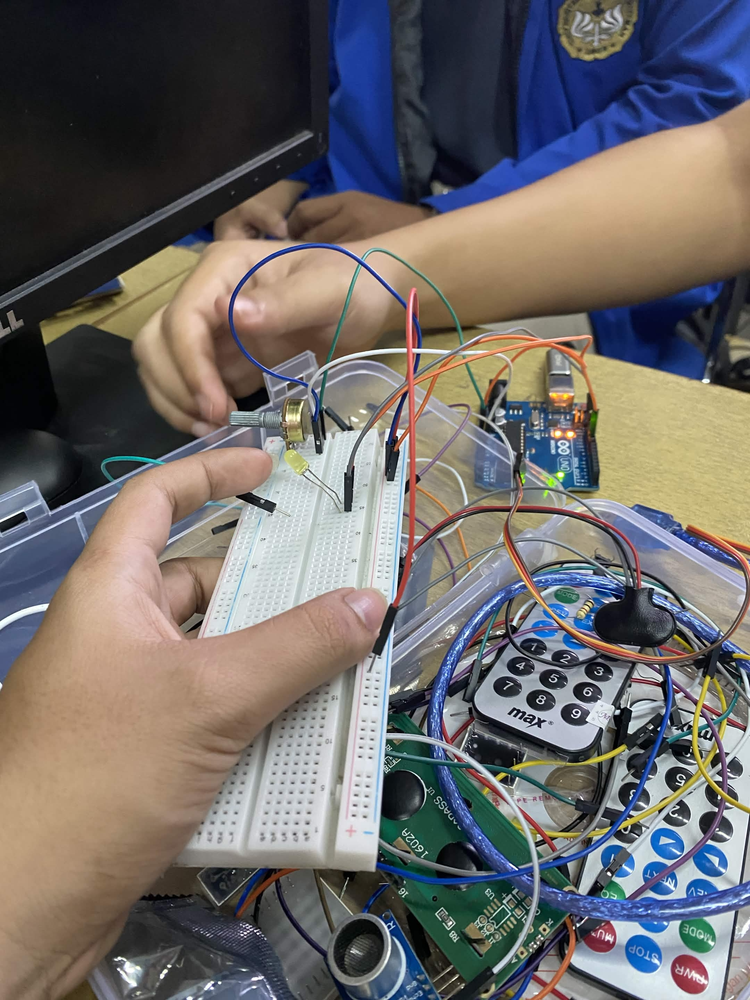

# Praktikum Mikrokontroler - Modul I: Analog to Digital Converter (ADC) dan Pulse Width Modulation (PWM)


**Nama:** Ibnu Abbas  
**NIM:** H1H024038  
**Mata Kuliah:** TK244005 - Praktikum Mikrokontroler  
**Program Studi:** Informatika, Universitas Jenderal Soedirman  

---

## 📌 Deskripsi Repositori
Repositori ini berisi source code, skematik rangkaian, dan dokumentasi hasil praktikum Modul 3 yang berfokus pada implementasi protokol komunikasi serial menggunakan antarmuka UART (Universal Asynchronous Receiver-Transmitter) dan I2C (Inter-Integrated Circuit) pada platform mikrokontroler Arduino Uno.

Praktikum ini dirancang untuk memahami bagaimana mikrokontroler dapat menerima komando interaktif dari antarmuka komputer melalui Serial Monitor (UART), serta bagaimana membaca nilai sensor analog (potensiometer) dan mentransmisikan datanya secara sinkron ke dalam modul display eksternal seperti LCD I2C.

---
## 🔬 Analisis Percobaan 1 (ADC)
### 1. Fungsi Perintah analogRead() pada Rangkaian Praktikum
Implementasi fungsi analogRead() pada platform Arduino diaplikasikan untuk melakukan akuisisi data tegangan dari pin input analog, semisal pada terminal A0 yang terintegrasi dengan komponen potensiometer. Arsitektur mikrokontroler ini dilengkapi dengan modul Analog to Digital Converter (ADC) yang memiliki spesifikasi resolusi sebesar 10-bit. Secara teknis, mekanisme tersebut berperan dalam mentransformasikan fluktuasi level tegangan antara 0V hingga 5V menjadi representasi data digital diskrit dalam rentang numerik 0 sampai dengan 1023.
### 2. Mengapa Diperlukan Fungsi map() dalam Program?
Fungsi map() digunakan untuk penskalaan nilai secara proporsional.
ADC menghasilkan nilai 0-1023, sedangkan motor servo memerlukan input 0-180 derajat. Tanpa konversi, nilai ADC yang melebihi batas akan menyebabkan malfungsi pada servo. Oleh karena itu, map() menyesuaikan rentang input (0-1023) menjadi rentang output yang valid (0-180).
### 3.   Program Modifikasi (Servo bergerak pada rentang 30° hingga 150°)
```#include <Servo.h> // library untuk servo motor

Servo myservo; // membuat objek servo

// ===================== PIN SETUP =====================
// Tentukan pin yang digunakan untuk potensiometer dan servo
const int potensioPin = A0;   // pin analog input untuk potensiometer
const int servoPin = 9;       // pin digital untuk servo (PWM)

// ===================== VARIABEL =====================
// Variabel untuk menyimpan data ADC dan sudut servo
int pos = 0; // inisialisasi awal variabel posisi sudut servo
int val = 0; // inisialisasi awal variabel data bacaan ADC

void setup() {
  // Hubungkan servo ke pin yang sudah ditentukan
  myservo.attach(servoPin); 

  // Aktifkan komunikasi serial untuk monitoring
  Serial.begin(9600); 
}

void loop() {
  // ===================== PEMBACAAN ADC =====================
  // Baca nilai dari potensiometer (rentang 0–1023)
  val = analogRead(potensioPin); 

  // ===================== KONVERSI DATA =====================
  // Ubah nilai ADC menjadi sudut servo modifikasi (30–150 derajat)
  pos = map(val, 0, 1023, 30, 150);  

  // ===================== OUTPUT SERVO =====================
  // Gerakkan servo sesuai hasil mapping
  myservo.write(pos); 

  // ===================== MONITORING DATA =====================
  // Tampilkan data ADC dan sudut servo ke Serial Monitor
  Serial.print("ADC Potensio: ");
  Serial.print(val); 

  Serial.print(" | Sudut Servo: ");
  Serial.println(pos); 

  // ===================== STABILISASI =====================
  // Delay untuk memberi waktu servo bergerak stabil
  delay(15); 
}
```

---
## Analisa Percobaan 2
### 1. Mengapa LED dapat diatur kecerahannya menggunakan fungsi analogWrite()?
Fungsi analogWrite() tidak benar-benar mengeluarkan tegangan analog murni, melainkan menggunakan teknik PWM (Pulse Width Modulation). PWM memanipulasi sinyal digital (HIGH dan LOW) dengan cara mengatur seberapa lama sinyal berada dalam keadaan HIGH (menyala) dalam satu periode waktu tertentu, yang disebut sebagai duty cycle.

Dengan mengubah persentase duty cycle, Arduino dapat mengubah nilai "tegangan rata-rata" yang diterima oleh LED. Jika duty cycle besar (HIGH lebih lama daripada LOW), maka tegangan rata-rata akan tinggi dan LED menyala terang. Sebaliknya, jika duty cycle kecil, tegangan rata-rata menjadi rendah dan LED terlihat meredup. Mata manusia tidak bisa melihat kedipan sinyal digital yang sangat cepat ini, sehingga yang terlihat hanyalah perubahan intensitas cahaya (analog semu).
### 2.  Hubungan antara nilai ADC (0–1023) dan nilai PWM (0–255)
Korelasi keduanya berpijak pada perbedaan resolusi perangkat keras Arduino Uno:
ADC memiliki resolusi 10-bit (0-1023).
PWM memiliki resolusi 8-bit (0-255).
Akibat perbedaan ini, nilai ADC harus diskalakan melalui fungsi map() atau pembagian dengan 4 agar sesuai dengan rentang output PWM.
### 3.Program Modifikasi (LED hanya menyala pada rentang PWM 50-200)
```#include <Arduino.h> 

// ===================== PIN SETUP =====================
const int potPin = A0;   // pin analog untuk membaca potensiometer
const int ledPin = 9;    // pin digital PWM untuk output ke LED

// ===================== VARIABEL =====================
int nilaiADC = 0;  
int pwm = 0;       

void setup() {
  // Atur pin LED sebagai output
  pinMode(ledPin, OUTPUT);

  // Aktifkan komunikasi serial
  Serial.begin(9600); 
}

void loop() {
  // ===================== PEMBACAAN SENSOR =====================
  nilaiADC = analogRead(potPin); 

  // ===================== PEMROSESAN DATA =====================
  // Mapping dasar dari rentang ADC ke rentang PWM maksimal
  pwm = map(nilaiADC, 0, 1023, 0, 255);  

  // ===================== LOGIKA MODIFIKASI =====================
  // LED hanya menyala jika nilai PWM berada di antara 50 dan 200
  if (pwm >= 50 && pwm <= 200) {
    analogWrite(ledPin, pwm); // LED menyala sesuai kecerahan PWM saat ini
  } else {
    analogWrite(ledPin, 0);   // Di luar rentang 50-200, matikan LED (PWM = 0)
  }

  // ===================== MONITORING DATA =====================
  Serial.print("ADC: ");
  Serial.print(nilaiADC); 

  Serial.print(" | PWM Awal: ");
  Serial.print(pwm); 
  
  Serial.print(" | Status LED: ");
  if (pwm >= 50 && pwm <= 200) {
    Serial.println("MENYALA");
  } else {
    Serial.println("MATI");
  }

  // Delay untuk stabilisasi
  delay(50); 
}
```


---

## 📸 Dokumentasi Praktikum
### 1. Dokumentasi Percobaan
Percobaan 1:

Percobaan 2: 


### 2. Skematik Rangkaian
Skematik Rangkaian prcobaan 1

Skematik Rangkaian prcobaan 2


*Laporan praktikum lengkap beserta analisis data tersedia pada direktori utama repositori ini dalam format dokumen.*
